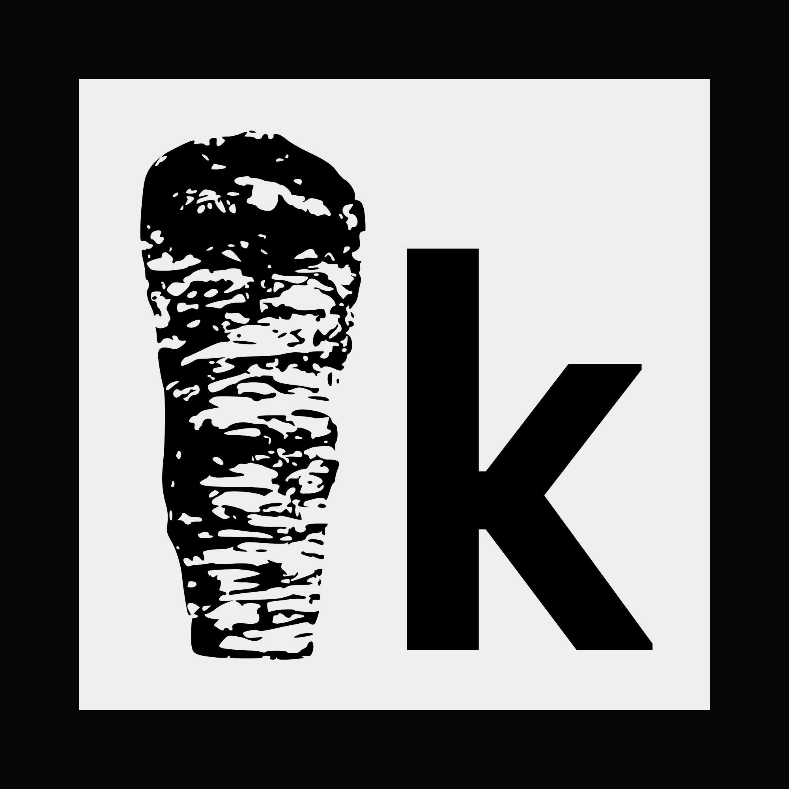

<div align="center">
  <a href="https://kebab.is-a.software"></a>
  <h1>kebabOS - v0.3.0</h1>
  <b>A high-performance, window-based operating system environment built entirely in Pygame. Features a custom kernel with event routing, window management, and graphical web rendering.</b>
</div>

---

## Features

- Dynamic Window Manager: Drag, resize, and stack multiple applications.
- Smart Taskbar: Pin/unpin apps via context menus with real-time "running" indicators (teal bar).
- kebabBrowser: Graphical web rendering using `html2image` with scroll support and clipboard integration.
- Clipboard Support: Full Ctrl+V pasting functionality in text fields.
- Persistence: Saves your pinned apps and settings to `storage/data.json`.


## Required Installations

Before running the OS, you must install the following dependencies via PyPI:

```bash
pip install pygame requests html2image
```

### Linux Users

If you are on a Linux distribution, you must also install `xclip` to enable the clipboard (copy/paste) functionality:

```bash
sudo apt-get install xclip
```

> [!IMPORTANT]
> The browser app requires a Chromium-based browser (Google Chrome, Microsoft Edge, or Chromium) installed on your system to render webpage graphics


## Documentation

Find the full documentation for kebabOS in [the docs directory](docs).


## Controls & Usage

**Action	Control:**
- Open Start Menu	Click the kebab icon (bottom-left)
- Pin to Taskbar	Right-click app in Start Menu -> "Pin to Taskbar"
- Unpin App	Right-click icon on Taskbar -> "Unpin"
- Resize Window	Drag the bottom-right corner handle
- Paste URL	Press Ctrl + V while the Browser is active
- Clear URL Bar	Click the × button in the Browser address bar
- Scroll Webpage	Use the Mouse Wheel inside the Browser window

## Developer Notes

Event Routing: The kernel automatically sends `KEYDOWN` and `MOUSEWHEEL` events to the top-most (active) window.
Clipping: Content is rendered using `surface.set_clip()` to prevent UI overlap during resizing or scrolling.
[Learn how to create applications.](docs/Custom_Apps.md)


## License

kebabOS is under the [MIT License](LICENSE).

<br /><br />
<hr/>

<div align="right">
<sub>
  &copy; kebab 2026
</sub>
</div>
